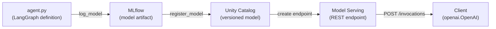

# 15. Databricks Deployment

Deploy a LangGraph agent as a **Databricks Model Serving endpoint** — packaging the graph with MLflow and serving it via the same OpenAI-compatible API used throughout the course.

## Deployment Pipeline



## How It Works

1. **`agent.py`** defines the LangGraph agent (tools, LLM binding, graph compilation) and calls `mlflow.models.set_model(graph)` at the bottom to declare what MLflow should serve.

2. **`mlflow.langchain.log_model(lc_model="agent.py")`** stores the source file as an MLflow artifact (models-from-code). The serving container re-executes this file at startup.

3. **`mlflow.register_model()`** publishes the artifact to Unity Catalog — a versioned, governed registry that Model Serving can pull from.

4. **`w.serving_endpoints.create()`** (Databricks SDK) creates the serving endpoint — provisions the container, installs dependencies, loads the model, and exposes an OpenAI-compatible REST API.

## Files

| File | Purpose |
|------|---------|
| `agent.py` | Self-contained LangGraph agent with 4 tools. MLflow serializes this file via models-from-code. |
| `deployment.ipynb` | **The deployment notebook** — run this inside your Databricks workspace. |
| `streamlit_app.py` | Chat UI to talk to the deployed endpoint (run locally after deployment). |

## Quick Start

### 1. Upload files to Databricks

Upload `agent.py` and `deployment.ipynb` to your Databricks workspace (e.g. into your user folder under `/Users/<you>/wk5-deployment/`).

### 2. Run the notebook

Open `deployment.ipynb` in Databricks and run all cells. The notebook will:

1. Install dependencies (`mlflow`, `langchain`, `langgraph`, `langchain-openai`, `openai`)
2. Set environment variables (auto-detects workspace host and token)
3. Verify `agent.py` imports cleanly
4. Log the model to MLflow using models-from-code
5. Register it in Unity Catalog
6. Create the serving endpoint via the Databricks SDK

### 3. Wait for the endpoint

The endpoint takes **3-8 minutes** to provision. Check status in the Databricks UI: **Machine Learning > Serving > cs4603-langgraph-agent**.

### 4. Test the endpoint

Once READY, call it from anywhere:

```python
import openai

client = openai.OpenAI(
    api_key="dapi...",
    base_url="https://<workspace>.databricks.com/serving-endpoints",
)

response = client.chat.completions.create(
    model="cs4603-langgraph-agent",
    messages=[{"role": "user", "content": "What is RAG?"}],
)
print(response.choices[0].message.content)
```

### 5. Chat UI (optional)

Run the Streamlit app locally to get a chat interface:

```bash
streamlit run wk5_langgraph/15.databricks_deployment/streamlit_app.py
```

Set the host, token, and endpoint name in the sidebar.

## What Happens Behind the Scenes

When you create a serving endpoint, Databricks:

1. **Provisions a container** with the requested workload size
2. **Installs pip packages** captured by MLflow during `log_model`
3. **Executes `agent.py`** top-to-bottom — creates the LLM client, defines tools, compiles the graph, calls `set_model(graph)`
4. **Runs a health check** — verifies the model loaded and can accept requests
5. **Goes READY** — starts accepting inference requests via the REST API

If step 3 fails (missing env vars, import errors), the endpoint enters `DEPLOYMENT_FAILED` state. Check the **Logs** tab in the Serving UI for the Python traceback.

After the endpoint scales to zero (due to inactivity), the next request triggers a **cold start** (~60-90 seconds) that repeats steps 1-5 with cached packages.

## Environment Variables

`agent.py` reads these at import time to configure its LLM client:

| Variable | Value | How it's set |
|----------|-------|--------------|
| `DATABRICKS_HOST` | `https://<workspace>.databricks.com` | Auto-detected in notebook; set via secrets on endpoint |
| `DATABRICKS_TOKEN` | Personal Access Token | Auto-detected in notebook; set via secrets on endpoint |
| `DATABRICKS_MODEL` | `databricks-qwen35-122b-a10b` | Set in notebook |

For the serving endpoint, these are configured as `environment_vars` using Databricks secret references (`{{secrets/scope/key}}`) so tokens don't appear in plain text.

## Secrets Setup

The serving container needs credentials to call the LLM. Store them in a **secret scope** — a secure key-value store in Databricks where sensitive values like tokens are encrypted and never appear in plain text.

Run these commands once from any terminal with the Databricks CLI installed:

```bash
databricks secrets create-scope cs4603-deploy
databricks secrets put-secret cs4603-deploy DATABRICKS_TOKEN --string-value "dapi..."
databricks secrets put-secret cs4603-deploy DATABRICKS_HOST --string-value "https://<workspace>.databricks.com"
databricks secrets put-secret cs4603-deploy DATABRICKS_MODEL --string-value "databricks-qwen35-122b-a10b"
```

The deployment notebook references these in the endpoint's `environment_vars` as `{{secrets/cs4603-deploy/DATABRICKS_TOKEN}}` etc.

## Cleanup

```python
from databricks.sdk import WorkspaceClient
w = WorkspaceClient()
w.serving_endpoints.delete("cs4603-langgraph-agent")
```

With `scale_to_zero=True`, the endpoint costs nothing when idle — only delete if you want to fully remove the resource.

## Troubleshooting

| Issue | Fix |
|-------|-----|
| `DEPLOYMENT_FAILED` — model loading error | Check Logs tab in Serving UI for the Python traceback. Usually a missing package or env var. |
| `Missing required environment variables` | Ensure secrets are configured (see Secrets Setup above). |
| Endpoint stuck in `NOT_READY` | Wait 3-8 min for first deploy. Check Serving UI for progress. |
| `ModuleNotFoundError` in serving logs | Add the missing package to the `%pip install` cell and re-log/re-deploy. |
